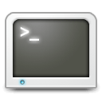

# PR Stats CLI - The CLI tool for pull request stats



_The PR Stats CLI is a command-line interface tool that you use to get stats about pull requests directly from a command shell._

### Supported version control platforms

- [x] Azure DevOps Git
- [ ] GitHub

## Getting started

You can download pre compiled cli tool from below, or you can build it from source.

### Download

| OS             | Download |
| -------------- | -------- |
| 64-bit macOS   | -        |
| 64-bit Windows | -        |
| 64-bit Linux   | -        |

> If your OS is not listed here, you can build the project from the source code.

### Publishing from source

You will need [.NET 8 SDK](https://dotnet.microsoft.com/en-us/download/dotnet/8.0) to build the tool from the source.

Clone the repository:

```bash
git clone https://github.com/arunes/prstats-cli.git
```

Go to the source code folder in your terminal, and publish:

```
dotnet publish
```

## Usage

The tool downloads your pull request data and runs commands on the offline data. If you need to update your data see [fetch](#fetch-fetch) command.

```bash
Description:
  PR Stats CLI - The CLI tool for pull request stats

Usage:
  prstats [command] [options]

Options:
  --version       Show version information
  -?, -h, --help  Show help and usage information

Commands:
  fetch    Gets the latest data from your version controller.
  purge    Cleans up your version controller settings and pull requests data.
  reports  Lists all the available reports.
  run      Gets pull request stats.
  setup    Runs the wizard to setup your version controller.
```

### Pull requests `run`

```bash
Description:
  Runs pull request reports.

Usage:
  prstats run [options]

Options:
  --status <Abandoned|Active|All|Completed>  Filter by status. [default: Completed]
  --branch <branch>                          Filter by status. []
  --before <before>                          Filter by date (shows pull requests before and on. Date format must be in
                                             YYYY-MM-DD. []
  --after <after>                            Filter by date (shows pull requests after and on. Date format must be in
                                             YYYY-MM-DD. []
  --date-type <Completed|Created>            Specify a date type. [default: Completed]
  --report-id <report-id>                    Specify a report id. You can get list of reports by running `reports`
                                             command. []
  -?, -h, --help                             Show help and usage information
```

#### Examples

Shows results only for active pull requests:

```bash
prstats run --status active
```

Shows results for completed pull requests that are created after Jan 1st, 2024:

```bash
prstats run --status completed --date-type created
```

### Setup `setup`

```bash
Description:
  Runs the wizard to setup your version controller.

Usage:
  prstats setup [options]

Options:
  -?, -h, --help  Show help and usage information
```

### Fetch `fetch`

```bash
Description:
  Gets the latest data from your version controller.

Usage:
  prstats fetch [options]

Options:
  -?, -h, --help  Show help and usage information
```

### Reports `reports`

```bash
Description:
  Lists all the available reports.

Usage:
  prstats reports [options]

Options:
  -?, -h, --help  Show help and usage information
```

### Purge `purge`

```bash
Description:
  Cleans up your version controller settings and pull requests data.

Usage:
  prstats purge [options]

Options:
  --data-only     Only deletes the data and not version controller settings. [default: False]
  -?, -h, --help  Show help and usage information
```

#### Examples

Purge pull request data and version controller settings:

```bash
prstats purge
```

Purge pull request data:

```bash
prstats purge --data-only
```
